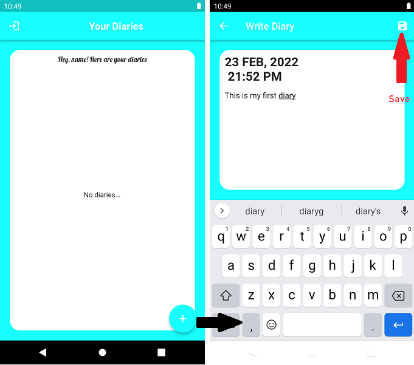
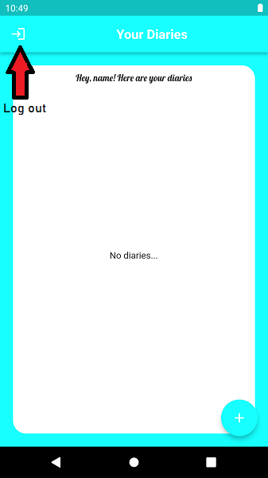

<a href="https://www.buymeacoffee.com/asimjunaidcodes" target="_blank"></a>
# Diary App with Flutter NodeJS 

<p align = "center">

</p>

## Introduction 

The diary app is an cross platform application that enables the users to write and store daily diaries. The application includes:
 - User Authentication
 - Create diary
 - Read diaries
 - Update diaries
 - Delete diaries


| Tech Stack Used |
|:---------------:|
| MongoDB |
| ExpessJs |
| Flutter |
|Nodejs|

## How to run:

### Clone the repo
Create a project folder and open it where you want to clone the Repo:

```bash
mkdir Diary-App
```

```bash
cd Diary-App
```  

### Start the backend server

Inside the project open the `backend-nodejs-mongodb` and start the server by executing:

```bash
node index.js
```  
The server will start running on `http://localhost:3000`

### Launch the Frontend app

In an another terminal open the flutter project folder again and launch the flutter app by executing flutter run:

```bash
cd diary_app
```  

```bash
flutter run lib/main.dart
```  

## Application Screenshots

### Login page


### Sign up


### Write new diary 



### Read, update and delete diary


### Log Out



## Connect with me

<a href = "https://hashnode.com/@AwsmAsim">

</a>

<a href = "https://twitter.com/AsimJunaid19">

</a>

<a href="https://www.linkedin.com/in/asim-junaid-07224517b/">


</a>


